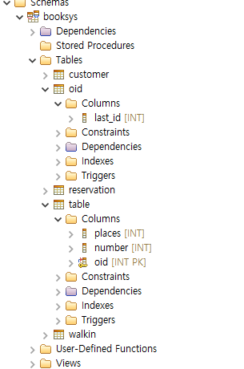
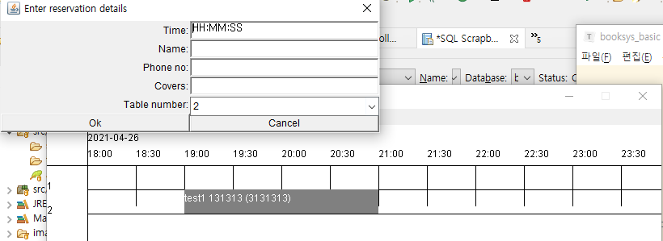
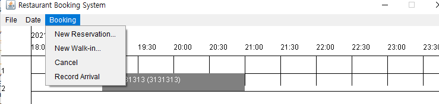
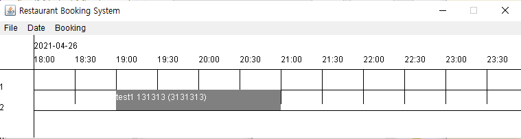

## 데이터베이스 관련

oid가 있어야만 table을 추가로 생성할 수 있다.

## 프로그램 관련

시간

이름

휴대폰번호(숫자)

covers(숫자) : 몇칸 차지할지 입력

table numbe: 테이블 번호 (테이블이 이미 DB에 들어있어야 함)

예약 옵션

reservation: 예약

walk-in: 방문

예약 성공했을 때의 화면

