#  Eclipse에 MariaDB 설치하기

1. Data source Explorer window를 열어준다

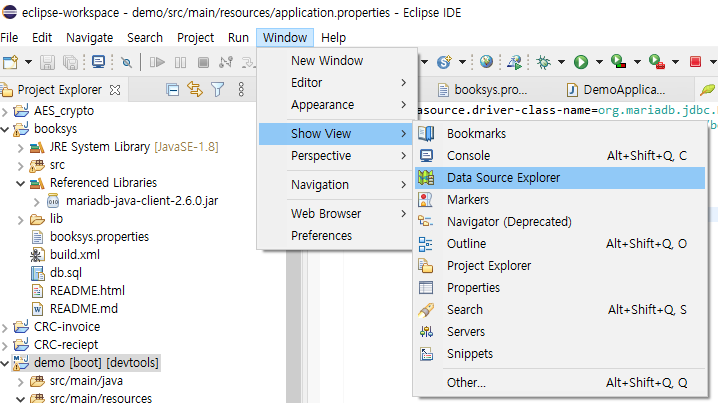

### 1-1 Data source explorer가 없을경우

Help -> Install New Software -> 화살표아이콘 클릭

~ /relese/<날짜> 형태의 링크 선택

Database Development 체크 후 Next 클릭 후 계속 진행

(사진캡처 당시 설치되어있어서 Next 비활성화)

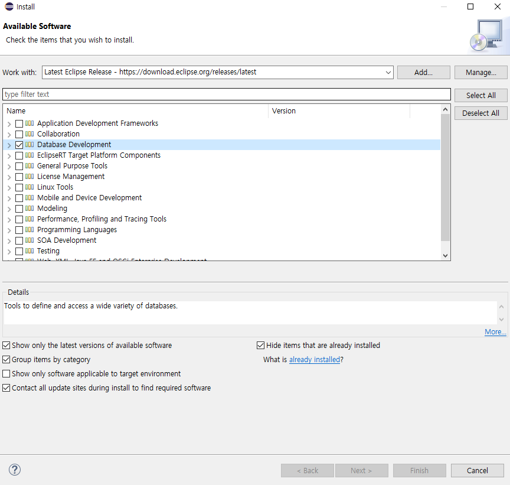

관련된 블로그 post 참조

https://blog.naver.com/PostView.nhn?blogId=gingsero&logNo=221026840250&proxyReferer=https:%2F%2Fwww.google.com%2F

2. Database Connections 에서 New 선택

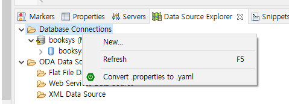

3. mysql 선택 후 Name 입력

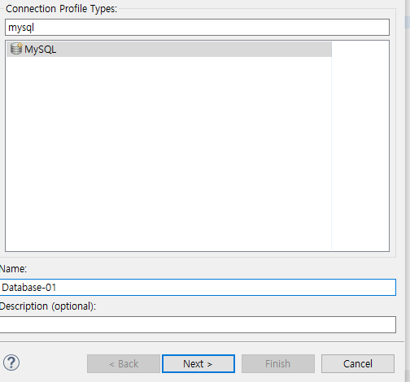

4. Driver 추가

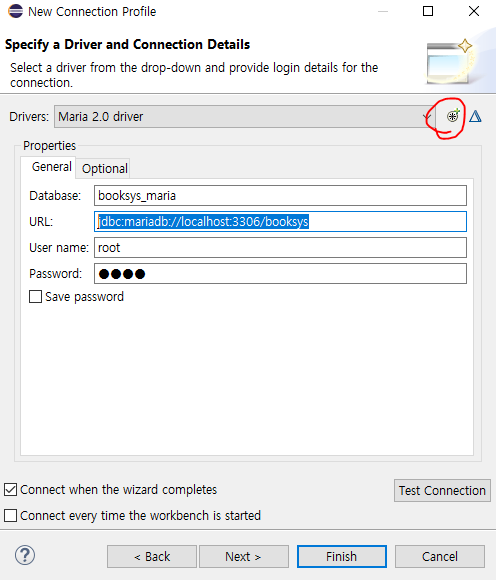

driver template선택 후 driver name 설정

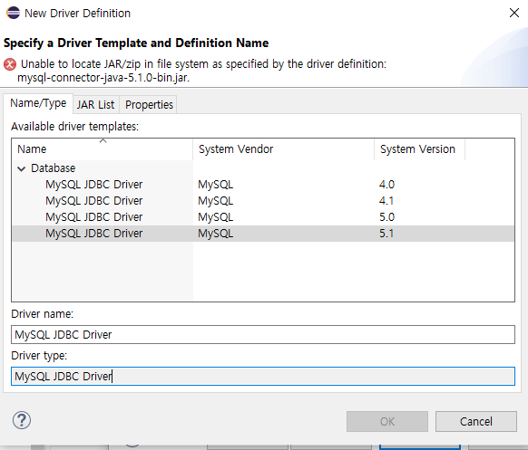

기존의 mysql-connector jar 파일을 삭제(remove)하고 maria connector jar 추가

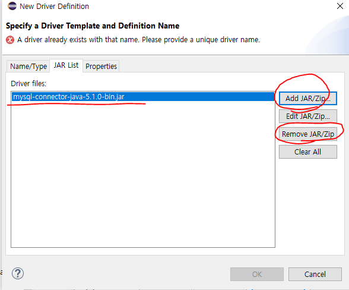

​	connector 파일 받는곳

​	https://downloads.mariadb.org/connector-java/

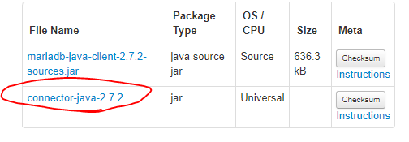

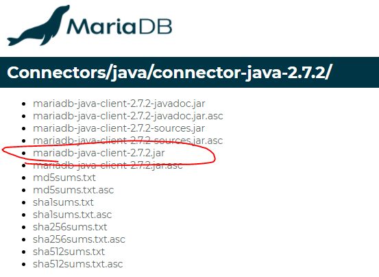

properties 수정

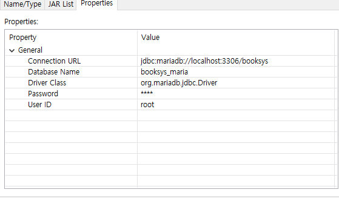

URL = jdbc:mariadb://localhost:3306/\<dbname\>

Driver Class = org.mariadb.jdbc.Driver

두가지는 고정, 나머지는 직접수정

생성한 Driver를 선택하고 DB에 대한 properties 수정

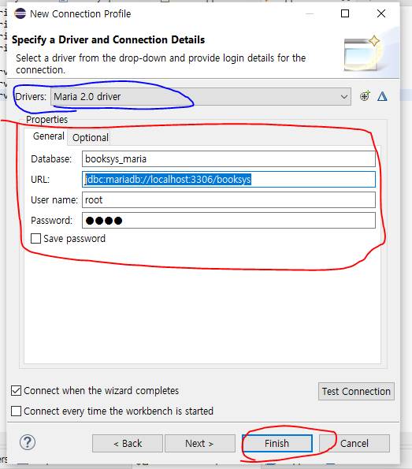

정상적으로 만들어지면 ping test가 성공함

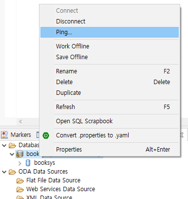

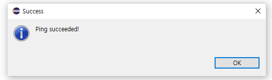

